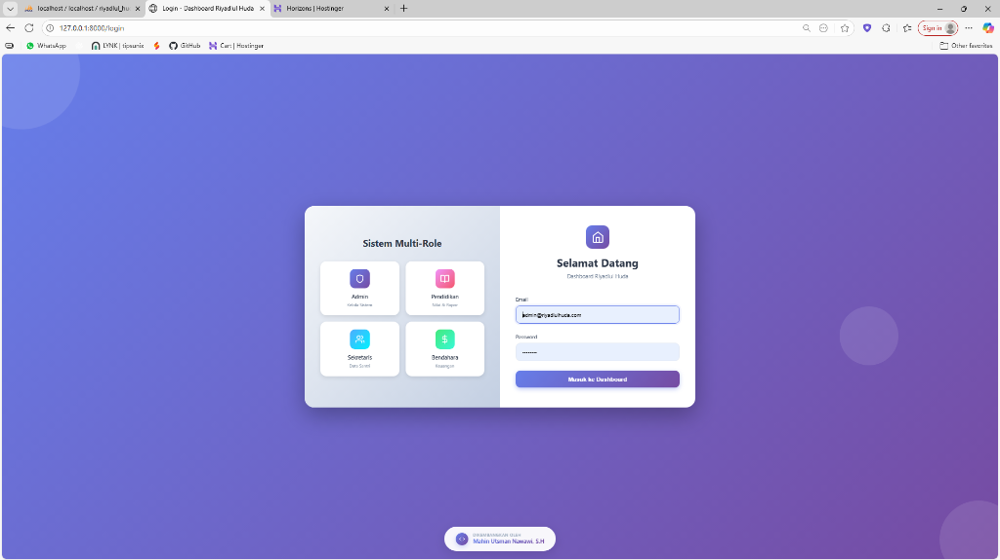
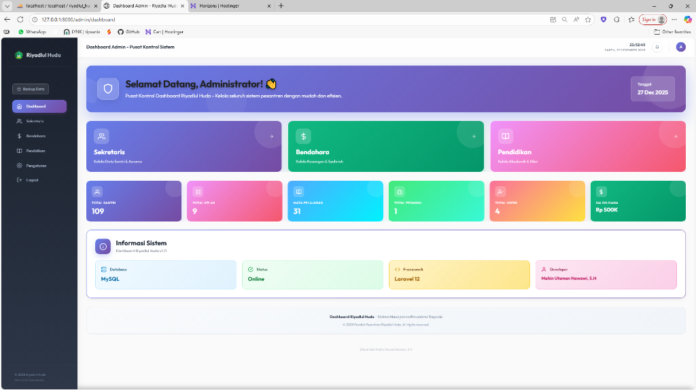

# 🏫 Dashboard Riyadlul Huda

Sistem Manajemen Pondok Pesantren berbasis web untuk mengelola data santri, pendidikan, keuangan, dan administrasi secara terpadu.


---

## 📸 Screenshot

### 🔐 Halaman Login


Halaman login dengan tampilan modern dan sistem **Multi-Role**. Pengguna dapat memilih role (Admin, Pendidikan, Sekretaris, Bendahara) dan login dengan kredensial masing-masing. Desain menggunakan gradient purple yang elegan dengan animasi background.

---

### 👨‍💼 Dashboard Admin


**Pusat Kontrol Sistem** - Admin memiliki akses penuh ke seluruh modul:
- 📊 Statistik total santri, kelas, mata pelajaran, dan dana
- 🔗 Quick access ke modul Sekretaris, Bendahara, Pendidikan
- ℹ️ Informasi sistem (Database, Status, Framework, Developer)
- 📅 Tanggal real-time

---

### 📚 Dashboard Pendidikan


**Modul Akademik Lengkap** untuk mengelola:
- 📈 Grafik rata-rata nilai per kelas
- 📊 Sebaran nilai santri
- 🎓 Statistik: Total santri aktif, kelas, mata pelajaran
- 📉 Tingkat kehadiran (53%) dan guru mengajar (28)
- 📝 Input nilai terbaru & data absensi terbaru
- 🔍 Filter berdasarkan tahun ajaran, semester, kelas, gender

---

### 📋 Dashboard Sekretaris


**Manajemen Data Santri** dengan fitur:
- 👥 Total santri putra (55) dan putri (54)
- 🏠 Jumlah asrama (5), kelas (9), dan kobong (100)
- ⚡ Quick Actions: Data Santri, Tambah Santri, Mutasi, Laporan
- 📋 Panduan penggunaan untuk staff baru
- 🎨 UI colorful dengan gradient cards

---

### 💰 Dashboard Bendahara


**Sistem Keuangan Terintegrasi**:
- 💵 Saldo kas: Rp 1.000.000
- 📈 Pemasukan: Rp 1.000.000 | Pengeluaran: Rp 500.000
- ⚠️ Total tunggakan: Rp 54.000.000
- 📊 **5 Grafik Interaktif**:
  - Keuangan bulanan (bar chart)
  - Per asrama (bar chart)
  - Per kelas (bar chart)
  - Putra/Putri (pie chart)
  - Status Syahriah (donut chart)
- ⚡ Aksi Cepat: Tambah Syahriah, Catat Pemasukan/Pengeluaran, Bayar Gaji

---

## ✨ Fitur Utama

### 🔐 Multi-Role Authentication
- **Admin** - Akses penuh ke semua modul
- **Pendidikan** - Kelola nilai, absensi, rapor
- **Sekretaris** - Kelola data santri, mutasi
- **Bendahara** - Kelola keuangan, syahriah

### 📚 Modul Pendidikan
- Input & rekap nilai semester
- Smart Scoring (nilai otomatis minimal 5 untuk rapor)
- Absensi mingguan (Sorogan, Tahajud, dll)
- Sistem Talaran (tracking setoran hafalan)
- Ujian Mingguan dengan status kelulusan
- Cetak Rapor & Ijazah (PDF)
- Jadwal pelajaran

### 📋 Modul Sekretaris
- Data Santri (CRUD, import/export)
- Mutasi santri (keluar/pindah/lulus)
- Kenaikan kelas massal
- Perpindahan asrama/kobong

### 💰 Modul Bendahara
- Syahriah (SPP bulanan)
- Cek tunggakan + **Kirim tagihan via WhatsApp**
- Pemasukan & pengeluaran
- Gaji pegawai
- Laporan keuangan dengan grafik

### 🛠️ Fitur Sistem
- 📱 PWA (Progressive Web App) - installable
- 🔔 Notifikasi real-time
- ❓ FAQ/Bantuan context-aware per halaman
- 💾 Backup database otomatis
- 📊 Dashboard dengan statistik & grafik

---

## 🚀 Instalasi

### Persyaratan
- PHP 8.2+
- Composer
- MySQL 8.0+
- Node.js (opsional, untuk build assets)

### Langkah Instalasi

```bash
# Clone repository
git clone https://github.com/username/dashboard-riyadlul-huda.git
cd dashboard-riyadlul-huda

# Install dependencies
composer install

# Copy environment file
cp .env.example .env

# Generate application key
php artisan key:generate

# Konfigurasi database di .env
# DB_DATABASE=riyadlul_huda
# DB_USERNAME=root
# DB_PASSWORD=

# Jalankan migrasi & seeder
php artisan migrate --seed

# Jalankan server development
php artisan serve
```

Buka `http://localhost:8000` di browser.

---

## 👤 Akun Default

| Role | Email | Password |
|------|-------|----------|
| Admin | admin@riyadlulhuda.com | password |
| Pendidikan | pendidikan@riyadlulhuda.com | password |
| Sekretaris | sekretaris@riyadlulhuda.com | password |
| Bendahara | bendahara@riyadlulhuda.com | password |

> ⚠️ **Segera ganti password setelah deploy ke production!**

---

## 📁 Struktur Folder

```
├── app/
│   ├── Console/Commands/     # Artisan commands (backup, migrasi tahun ajaran)
│   ├── Http/Controllers/     # Controllers per modul
│   ├── Models/               # Eloquent models
│   └── Http/Middleware/      # Role-based access control
├── database/
│   ├── migrations/           # Database schema
│   └── seeders/              # Data awal
├── resources/views/
│   ├── admin/                # Views modul admin
│   ├── pendidikan/           # Views modul pendidikan
│   ├── sekretaris/           # Views modul sekretaris
│   ├── bendahara/            # Views modul bendahara
│   ├── layouts/              # Layout utama
│   └── components/           # Komponen reusable
├── public/
│   ├── css/                  # Stylesheets
│   ├── js/                   # JavaScript
│   ├── images/               # Gambar & logo
│   └── icons/                # PWA icons
└── routes/web.php            # Definisi routes
```

---

## 🌐 Deployment

### Shared Hosting (Hostinger/cPanel)
1. Upload semua file ke `public_html`
2. Jalankan `composer install` via SSH
3. Copy `.env.production` → `.env`, edit kredensial
4. `php artisan key:generate && php artisan migrate --seed`

Lihat panduan lengkap: [Hostinger Deploy Guide](docs/hostinger-deploy.md)

### VPS/Cloud
```bash
# Production optimization
php artisan config:cache
php artisan route:cache
php artisan view:cache
```

---

## 🔧 Konfigurasi

### Backup Otomatis
Backup database berjalan otomatis setiap hari jam 02:00.
```bash
# Manual backup
php artisan db:backup
```

### Migrasi Tahun Ajaran
```bash
php artisan migrasi:tahun-ajaran
```

---

## 📝 Testing

```bash
# Jalankan semua test
php artisan test

# Test spesifik
php artisan test --filter=AuthTest
php artisan test --filter=SantriTest
php artisan test --filter=NilaiTest
```

---

## 🤝 Contributing

1. Fork repository ini
2. Buat branch fitur (`git checkout -b feature/AmazingFeature`)
3. Commit perubahan (`git commit -m 'Add some AmazingFeature'`)
4. Push ke branch (`git push origin feature/AmazingFeature`)
5. Buat Pull Request

---

## 📄 License

Distributed under the MIT License. See `LICENSE` for more information.

---

## 👨‍💻 Developer

**Mahin Utsman Nawawi, S.H.**

---

## 🙏 Acknowledgments

- [Laravel](https://laravel.com)
- [Feather Icons](https://feathericons.com)
- [Chart.js](https://www.chartjs.org)
- [DomPDF](https://github.com/dompdf/dompdf)
