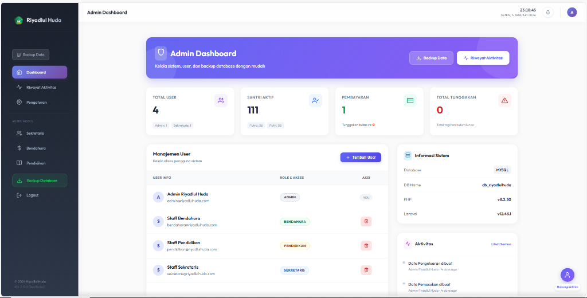
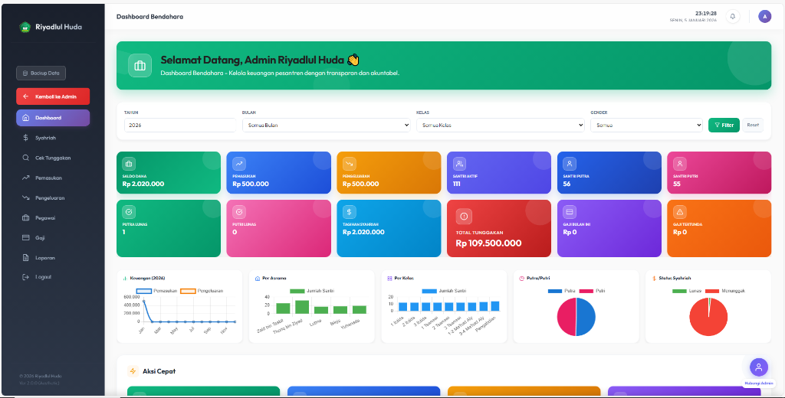
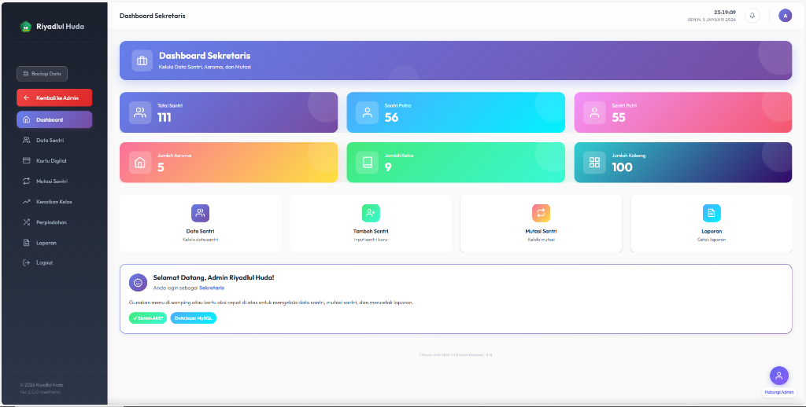
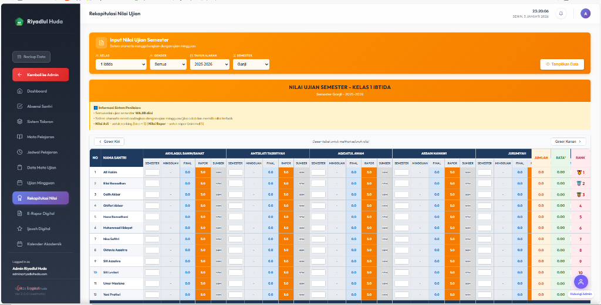
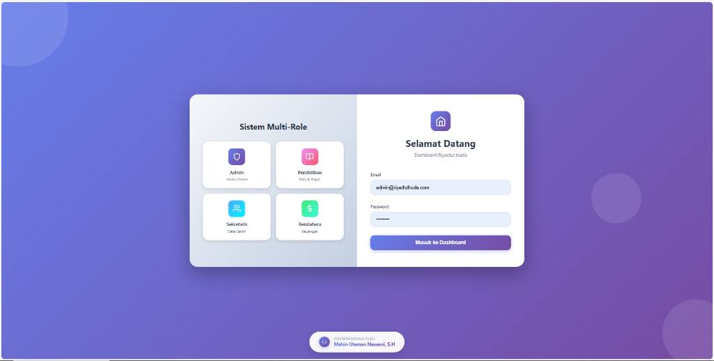

# Santrix - Sistem Manajemen Pesantren Modern

Platform All-in-One untuk Manajemen Keuangan SPP, Akademik, dan Laporan Yayasan. Terintegrasi dengan Payment Gateway & WhatsApp Gateway.

[](https://laravel.com)
[](https://www.php.net)
[](https://www.mysql.com)
[](https://tenancyforlaravel.com)

---

Preview Aplikasi

Dashboard Admin & Yayasan


Kontrol penuh sistem: manajemen user multi-role, backup database otomatis, dan monitoring aktivitas real-time.

Dashboard Bendahara (Keuangan & SPP)


Transparansi arus kas, pemasukan SPP Syahriah, monitoring tagihan, dan laporan keuangan.

Dashboard Sekretaris (Data Santri)


Kelola data santri terpadu: biodata, asrama, kelas, mutasi, dan administrasi kesantrian.

Akademik & E-Rapor Digital


Input nilai ujian semester, rekapitulasi otomatis, ranking, dan cetak rapor digital.

Sistem Login Multi-Role


Keamanan terjamin dengan pemisahan hak akses: Admin, Sekretaris, Bendahara, dan Pendidikan.

---

Fitur Utama

Keuangan & SPP (Syahriah)
- Dashboard dengan kartu statistik real-time (Saldo, Pemasukan, Pengeluaran, Tunggakan)
- Tagihan Syahriah otomatis per bulan
- Cek tunggakan santri
- WhatsApp Gateway: Kirim bukti bayar otomatis ke Wali Santri
- Laporan keuangan harian/bulanan (PDF)

Dashboard Bendahara
- Grafik pemasukan vs pengeluaran per bulan
- Statistik per asrama dan per kelas
- Monitoring status pembayaran (Lunas vs Menunggak)
- Quick action shortcuts

Data Santri (Sekretaris)
- Database santri lengkap (Putra/Putri)
- Manajemen asrama dan penempatan kamar
- Mutasi santri (masuk/keluar/pindah)
- Kartu digital santri
- Kenaikan kelas otomatis

Akademik & Pendidikan
- Manajemen kelas dan mata pelajaran
- Input nilai ujian semester (multi-mata pelajaran)
- Rekapitulasi nilai otomatis dengan ranking
- E-Rapor digital dengan format standar
- Kalender akademik

Keamanan & Multi-Role

| Role | Akses |
|------|-------|
| Admin | Full control: user management, backup, settings |
| Sekretaris | Data santri, mutasi, laporan |
| Bendahara | Keuangan, SPP, tagihan, laporan |
| Pendidikan | Nilai, rapor, akademik |

Owner Dashboard (Multi-Tenant)
- Kelola semua pesantren dari satu panel
- Manajemen paket langganan
- Monitoring pendapatan per tenant
- Activity logs
- Fitur withdrawal

---

Tech Stack

| Layer | Teknologi |
|-------|-----------|
| Backend | Laravel 12.x (PHP 8.2+) |
| Database | MySQL 8.0 |
| Frontend | Blade Templates, Tailwind CSS |
| Icons | Feather Icons |
| JavaScript | Alpine.js, Vanilla JS |
| Server | Nginx (Ubuntu VPS) |
| SSL | Let's Encrypt (Certbot) |
| Domain | Wildcard Subdomain (*.santrix.my.id) |

---

Arsitektur Multi-Tenant

```
yourdomain.com              → Landing Page
owner.yourdomain.com        → Owner Dashboard
pesantren1.yourdomain.com   → Tenant: Pesantren 1
pesantren2.yourdomain.com   → Tenant: Pesantren 2
```

Setiap pesantren mendapatkan subdomain unik dengan data isolation yang aman.

---

Quick Start (Development)

```bash
# Clone
git clone https://github.com/mahinutsmannawawi20-svg/santrix.git
cd santrix

# Install dependencies
composer install
npm install && npm run build

# Setup environment
cp .env.example .env
php artisan key:generate

# Configure .env
# Set database credentials
# Set CENTRAL_DOMAINS=santrix.test,owner.santrix.test

# Migrate & seed
php artisan migrate --seed

# Run
php artisan serve
```

Catatan: Gunakan Laravel Valet atau Laragon untuk support wildcard subdomain di development.

---

Production Deployment

Prerequisites
- Ubuntu 22.04 VPS
- Nginx
- PHP 8.2+ dengan extensions (pdo, mysql, mbstring, xml, curl, zip)
- MySQL 8.0
- Certbot untuk SSL

DNS Setup
```
A    @              → [IP VPS]
A    *              → [IP VPS]  (Wildcard)
A    owner          → [IP VPS]
```

Environment Variables
```env
APP_URL=https://yourdomain.com
CENTRAL_DOMAINS=yourdomain.com,owner.yourdomain.com
SESSION_DOMAIN=.yourdomain.com
```

Post-Deployment
```bash
php artisan migrate --force
php artisan config:cache
php artisan route:cache
php artisan view:cache
php artisan optimize
```

---

Responsivitas

Aplikasi dioptimalkan untuk:
- Desktop (1920px+)
- Laptop (1366px)
- Tablet (768px)
- Mobile (375px)

---

Developer

Dikembangkan oleh Mahin Utsman Nawawi, S.H & Tim Velora.

Dedikasi untuk kemajuan digitalisasi Pesantren Indonesia.

---

© 2026 Santrix Project. All rights reserved.
